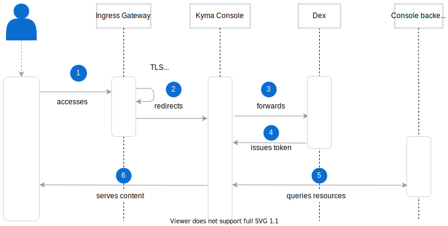
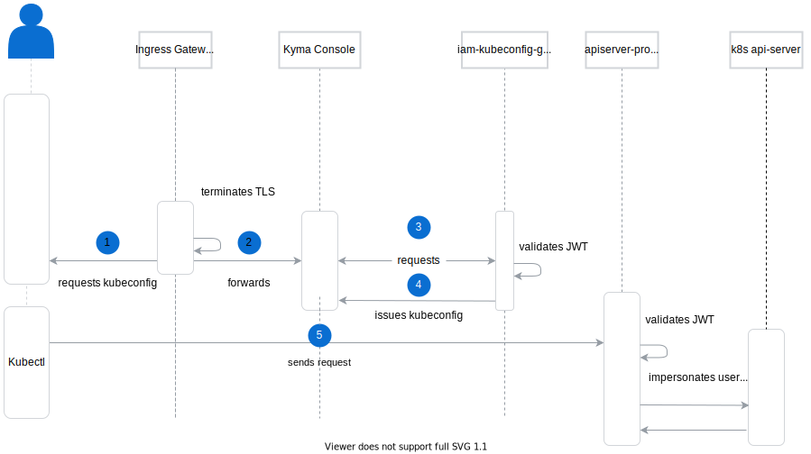

As a user, you can access Kyma using the following:

- [Kyma Console](components/console/#overview-overview) which allows you to view, create, and manage your resources. 
- [Kubernetes-native CLI (kubectl)](https://kubernetes.io/docs/reference/kubectl/overview/), which you can also use to manage your resources by means of a command line interface. Kyma uses a custom apiserver proxy to handle all connections between the user and the Kubernetes API server. To access and manage your resources, you need a config file which includes the JWT token required for authentication. You have two options:

    * Cluster config file you can obtain directly from your cloud provider. It allows you to directly access the Kubernetes API server, usually as the admin user. This configuration is not managed by Kyma.
    * Kyma-generated config file you can download using the Kyma Console. This config uses the Kyma `api-server` proxy to access the Kubernetes API server and predefined user configuration to manage access and restrictions. 

## Console UI

The diagram shows the Kyma access flow using the Console UI.



>**NOTE:** The Console is permission-aware so it only shows elements to which you have access as a logged in user. The access is RBAC-based.

1. Access the Kyma Console UI exposed by the [Istio Ingress Gateway](components/application-connector/#architecture-application-connector-components-istio-ingress-gateway) component. 
2. Under the hood, the Ingress Gateway component redirects all traffic to TLS, performs TLS termination, and forwards you to the Kyma Console.
3. If the Kyma Console does not find a JWT token in the browser session storage, it redirects you to Dex, the Open ID Connect (OIDC) provider. Dex lists all defined identity provider connectors, so you can select one to authenticate with.
4. After successful authentication, Dex issues a JWT token for you. The token is stored in the browser session so it can be used for further interaction.
5. When you interact with the Console, the UI queries the backend implementation and comes back to you with the response.

## kubectl

The diagram shows the Kyma access flow using kubectl.




1. You use the Console UI to request the IAM kubeconfig generator to generate the kubeconfig file. 
2. Under the hood, the Ingress Gateway terminates the TLS and allows the Kyma Console to proceed with the request.
3. The request goes out from the Kyma Console to the IAM kubeconfig generator.
4 IAM kubeconfig generator validates the in-session JWT token and generates a YAML file in the following form:

```yaml
apiVersion: v1
clusters:
- cluster:
    certificate-authority-data: SERVER_CERTIFICATE_REDACTED
    server: https://apiserver.kyma.local:9443
  name: kyma.local
contexts:
- context:
    cluster: kyma.local
    user: OIDCUser
  name: kyma.local
current-context: kyma.local
kind: Config
preferences: {}
users:
- name: OIDCUser
  user:
    token: TOKEN_REDACTED
```

The JWT token is stored in the config to allow you to use kubectl to communicate with the Kubernetes API server.
5. The generated config does not point directly to the Kubernetes API server, which is not exposed. Instead,if you want to communicate with the server to manage your resources, it goes through the apiserver-proxy service, which validates incoming JWT tokens and forwards requests to the Kubernetes API server.
